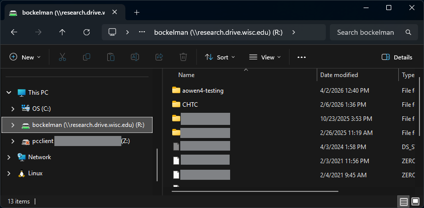

# Tutorial: Using ResearchDrive with CHTC

Learn how to use the computing power of CHTC with the data you keep in ResearchDrive.

[Slides for April 7th training](https://docs.google.com/presentation/d/1_Q5Xo6_tH7iPAlsANH6K469Wl9VS6zDNxVR9xG7A8QM/edit?usp=sharing)

## Overview

* [What is ResearchDrive?](#what-is-researchdrive)
* [Manual transfers](#manual-transfers)
* [Automated transfers](#automated-transfers)
* [UWDF: Beyond ResearchDrive](#uwdf-beyond-researchdrive)

## What is ResearchDrive?

ResearchDrive ([it.wisc.edu/services/researchdrive/](https://it.wisc.edu/services/researchdrive/)) is "a secure and permanent place for keeping data" for research groups at UW Madison.
Storage and access is managed by the PI of the research group, and each eligible research group gets 25TB of storage for free.

CHTC users have a few use cases for ResearchDrive:

* **Long term backup**: CHTC does not back up user data - ResearchDrive is the perfect resource for this!
* **Storing large inputs/outputs**: CHTC has a finite amount of space for user data - ResearchDrive can be used as a supplement.
* **Sharing data with collaborators**: ResearchDrive data can be shared with users outside of UW, without needing a CHTC account.

### Restricted ResearchDrive

ResearchDrive has a separate, dedicated system for handling protected data (e.g., personal identifying information).
**CHTC cannot (and should not!) access this Restricted ResearchDrive.**

CHTC systems are not rated for handling protected data.
You must not try to circumvent this, as you may break the law(s) protecting the data!!

There are other resources on campus rated for computing on protected data, if that is something you need.

> [!TIP]
> Not sure if your data is "protected"? In general, if the data is publically accessible (without requiring login/authentication) from a reputable source, then it is fine to use on CHTC.
> Feel free to check with the facilitation team for assistance!

### Getting access to ResearchDrive

**If your research group already has a ResearchDrive**, then you will need to work with your group members to get access.
The PI of the research group (or their designate) control the access to their ResearchDrive.

**If your group does not yet have a ResearchDrive**, the PI or their designate needs to complete the [Request Account](https://it.wisc.edu/services/researchdrive/) form.

> [!NOTE]
> CHTC does not manage ResearchDrive!
> If you have questions about the account process or getting access, you should contact the ResearchDrive team at [researchdrive@wisc.edu](mailto:researchdrive@wisc.edu).

### Accessing ResearchDrive

There are a few ways of accessing data in ResearchDrive, but the most common is "mounting" the drive to your computer as a network drive.
Once mounted, ResearchDrive appears as just another folder on your computer that you can interact with.



Setting this up is not the focus of our training; if you are interested in this, see their guides [for Windows](https://kb.wisc.edu/researchdata/96187), [for MacOS](https://kb.wisc.edu/researchdata/96187), or [for Linux](https://kb.wisc.edu/researchdata/95148).

> [!CAUTION]
> Do not use the Linux instructions to connect to ResearchDrive from a CHTC server!
> The exception is for the methods we discuss in this training.

## Manual transfers

You can manually transfer data to/from ResearchDrive and CHTC via the command line.
With this method, you are in full control of the data movement.

The following approach is also described in our guide [Transfer Files Between CHTC and ResearchDrive](https://chtc.cs.wisc.edu/uw-research-computing/transfer-data-researchdrive)

### Assumptions

* You have access to a ResearchDrive and know its address
* Your NetID has permission to access the desired data in the ResearchDrive
* You have a CHTC account
* Your CHTC account has permission to access the desired data on the CHTC server

### How it works

1. You login to the CHTC server
2. You use a file transfer client (`smbclient`) to login to your ResearchDrive
3. You initiate transfers to/from CHTC
4. Wait for transfers to complete

> [!IMPORTANT]
> You must remain connected to the CHTC server for the full duration of the transfer!
> While the data is transferred directly between CHTC and ResearchDrive servers, your active login is required to monitor the transfer.

### Logging in to CHTC

To transfer data to/from a CHTC server, you first need to be logged into the correct server.

* **HTC /home** - To transfer data to/from your `/home` directory on the HTC system, you need to login to your access point, typically `ap2001.chtc.wisc.edu` or `ap2002.chtc.wisc.edu`.
* **HTC /staging** - To transfer data to/from your `/staging` (or `/projects`) directory, you need to login to transfer server at `transfer.chtc.wisc.edu`. (Remember to `cd /staging/yourNetID` before transferring data!)
* **HPC** - To transfer data to/from your directories on the HPC system, you need to login to as normal to `spark-login.chtc.wisc.edu`.

### Connecting to ResearchDrive

Next, move into the directory on the CHTC server you want to work with.
For example, let's say that you have a `experiments` directoy in `/staging`:

```bash
cd /staging/yourNetID/experiments
```

When ready, run this command:

```bash
smbclient -k //research.drive.wisc.edu/<ResearchDrive_Name>
```

Here, you will need to replace `<ResearchDrive_Name` with the name assigned to your group's ResearchDrive, which typically involves the PI's name or NetID.

For example, if you are trying to access the ResearchDrive of Prof. Bucky Badger, your command might look like this:

```bash
smbclient -k //research.drive.wisc.edu/bbadger
```

> [!CAUTION]
> **If the address for your ResearchDrive is `restricted.drive.wisc.edu`**, then you are trying to access a Restricted ResearchDrive, which will fail!
> See the [Restricted ResearchDrive section](#restricted-researchdrive) above.

> [!TIP]
> **Not sure what your ResearchDrive address is?** You can run this command to check which ResearchDrives you have access to:
>
> ```bash
> smbclient -L //research.drive.wisc.edu/
> ```
>
> The `<ResearchDrive_Name>` values that you can use will be listed under the `Sharename` column in the output.
> If the list is empty, you don't have access to ResearchDrive (or you have a Restricted ResearchDrive).

If the command is successful, you should see this message:

```bash
Try "help" to get a list of possible commands.
smb: \>
```

You are now in an interactive prompt for using the `smbclient` to transfer data to/from ResearchDrive.
This works sort of like a regular command line, but with fewer possible commands that don't always work the way you expect.

> [!TIP]
> You can ignore the `WARNING: The option -k|--kerberos is deprecated!` message for now.
> The "correct" command to avoid this warning is to do
>
> ```bash
> smbclient --use-kerberos=desired //research.drive.wisc.edu/<ResearchDrive_Name>
> ```
>
> You don't need to know what "kerberos" is, other than that it enables you to "re-use" your authentication from when you logged into the CHTC server using your NetID.
> 
> Alternatively, you can use
>
> ```bash
> smbclient -U yourNetID //research.drive.wisc.edu/<ResearchDrive_Name>
> ```
>
> in which case you'll need to enter your NetID password when prompted.

You can see the full list of commands by running `help`, and see the help text for specific commands using `help commandName`.
Note that not all commands are enabled/available in the CHTC/ResearchDrive setup.

You can exit the `smbclient` prompt using most of the methods you are used to: `q`, `quit`, `exit`, `Ctrl`+`C` shortcut, and `Ctrl`+`D` shortcut.

> [!CAUTION]
> Some folks use `Ctrl`+`C` to their command prompt when they've made a mistake.
> Doing so in the `smbclient` prompt will cause it to exit!

### List your data in ResearchDrive

Using the `smbclient` command line, you find your data in ResearchDrive through combinations of `ls` and `cd` commands.

Running `ls` after starting the `smbclient` will show you the top level contents of your ResearchDrive.
Note how the output looks different from that of the Unix `ls` command.

If you want to see the contents of a directory in your ResearchDrive, you have to first `cd` into that directory.

> [!TIP]
> If you tab-autocomplete a directory name, you will see a backslash (`\`) appear at the end of the name, when usually in Unix you see a forward slash (`/`).
> Either one is acceptable in this case.

### Transfer a file from ResearchDrive

To download a file from ResearchDrive, run

```bash
get <file>
```

where `<file>` is the name of - or path to - a file in your ResearchDrive.

Optionally, you can change how the file is named in your CHTC directory with

```bash
get <file> <newname>
```

By default, the file will be returned to the directory **where you ran the `smbclient` command**.
You can have the file returned to a different location by using a relative or absolute path:

```bash
get <file> /home/yourNetID/<newname>
```

> [!WARNING]
> Make sure you use the forward slash (`/`) in this case.
> If you use a backslash (`\`) in the path, you'll create a file in the initial directory with a backslash in its name!

> [!TIP]
> Tab-autocomplete should work as expected for specifying the file in ResearchDrive or the location in CHTC to transfer it to!

### Transfer many files from ResearchDrive

To download more than one file at a time, you cannot just use the `get` command.

You need to use the `mget` command.

With the `mget` command, you can specify multiple names at a time, either by listing them one at a time or by using a "glob".

For example, to download all the files from your current ResearchDrive directory that end with `.txt`, you would use

```bash
mget *.txt
```

**But** the default behavior is to *prompt you to confirm every single transfer* (!).

To disable this prompt, run the command

```bash
prompt
```

> [!TIP]
> The `prompt` command is an invisible "toggle" - it won't tell you whether prompting is on or off!
> The first time you run the command in the `smbclient` session, you will toggle the state from "on" (the default) to "off".
> The second time, you'll toggle the state from "off" to "on", and so on and so forth.
> If you forget which state the toggle is in, just exit and restart the `smbclient` command line to reset the state to the default of "on".

Now when you run the `mget` command, it will just do the transfers instead of prompting you to confirm each one.

### Transfer a file to ResearchDrive

You can use the `put` command to transfer files from CHTC to ResearchDrive.

When you are using the `smbclient`, you can't `ls` your files & directories on CHTC.
However, you can use the tab-autocomplete functionality to display the possible autofill options.

If you launched the `smbclient` in the same directory as the file, and you remember the filename, you can just run

```bash
put <file>
```

You can also specify a different name to save the file in ResearchDrive

```bash
put <file> <newname>
```

You can also specify paths - remember to use forward slashes for specifying locations on CHTC.

### Transfer many files to ResearchDrive

We complete the square with the `mput` command.

* `put` is for uploading one file, `mput` is for many files
* You can use globs (e.g., `*`) to transfer files based on a pattern
* The `prompt` toggle affects the `mput` command as well for user confirmation

For example, if you have a bunch of `.csv` files in your CHTC directory you want to upload to ResearchDrive,
you could use

```bash
mput *.csv
```

## Automated transfers

CHTC and the ResearchDrive team has set up infrastructure to enable automatic transfer of data to and from ResearchDrive and CHTC.
With this method, your jobs will automatically transfer their input data on start up and automatically transfer output data on completion, using built-in HTCondor mechanisms.

The following approach is also described in our guide [Directly transfer files between ResearchDrive and your jobs](https://chtc.cs.wisc.edu/uw-research-computing/htc-uwdf-researchdrive).

### Assumptions

* You have access to a ResearchDrive and know its address
* You have a CHTC account
* The ResearchDrive you are using has been integrated with CHTC
* Data in ResearchDrive is located in the `CHTC` top level folder

> [!IMPORTANT]
> The integration with CHTC is not enabled by default in ResearchDrive!
> The ResearchDrive team has to enable the integration by request of the PI.

### How it works

1. Input data is stored in the `CHTC` top level folder in ResearchDrive
2. You use the special `pelican` address (see below) in your submit file to specify input and output transfers involving ResearchDrive
3. You submit the job; the job will transfer specified inputs from ResearchDrive on startup, and transfer specified outputs back to ResearchDrive on completion.
4. Output data is returned to the `CHTC` top level folder in ResearchDrive

> [!CAUTION]
> **You must not change the content of files that have been transferred as input without changing the file name!**
> Input data transferred from ResearchDrive to CHTC via `pelican` is cached (copied) locally to enable efficient re-use.
> If the contents of a file changes at ResearchDrive without a name change, the job could get the old version of the file, the new version, or some unholy combination of the two!

### The CHTC folder in ResearchDrive

When the integration between ResearchDrive and CHTC has been set up, a `CHTC` folder is created in the top level of the ResearchDrive.

**The automated transfers can only access the `CHTC` folder of your ResearchDrive!**
If you try to use the automated transfer with other parts of your ResearchDrive, the transfers will fail with a "not found" or "permission denied" error.

This is deliberate! Why?

***CHTC has total permissions to modify the contents of the `CHTC` folder in ResearchDrive!***

Like with the `/staging` directory, you are giving CHTC staff and software the ability to read and write the contents of the `CHTC` folder.
You should not put any sensitive data into the `CHTC` folder (or on CHTC in general) and data should be copied elsewhere in case a severe software bug wipes the content of the `CHTC` folder.

> [!NOTE]
> Setting up a "symlink" in the `CHTC` folder that points to data stored elsewhere in the ResearchDrive will not work.

### The pelican address

To declare the automated transfer of data to/from ResearchDrive in your submit file, you have to know the `pelican` address.
(`pelican` is the software that enables the automated transfer.)

The name of the ResearchDrive is typically named after the PI that owns it.
For example, the ResearchDrive of Prof. Bucky Badger might have the name `bbadger`.

For the automated transfer, the `pelican` address you would use is `pelican://chtc.wisc.edu/researchdrive/<ResearchDrive_Name>/CHTC`.
For example, members of Prof. Badger's group might use `pelican://chtc/wisc.edu/researchdrive/bbadger/CHTC`.

This address points to the top level `CHTC` folder that has been set up in your ResearchDrive as part of the integration with CHTC.

> [!IMPORTANT]
> The `pelican` address uses two slashes after the colon, not three!
>
> ❌ `pelican:///chtc.wisc.edu/`
>
> ✔️ `pelican://chtc.wisc.edu/`
>
> The `osdf` address used to reference the `/staging` directory can use two or three; either is fine.

### Transfer input files from ResearchDrive

First, make sure the data you want to transfer has been copied to the `CHTC` folder in your ResearchDrive.
Then update your submit file to use the `pelican` address that points to the input data in your `CHTC` folder in ResearchDrive.

To illustrate how this looks, let's pretend we placed the files `my-container.sif`, `my-script.sh`, and `my-data.csv` in the `CHTC` folder in ResearchDrive

```
<ResearchDrive_Name>
└── CHTC
    ├── my-container.sif
    ├── my-data.csv
    └── my-script.sh
```

We can use the `pelican` address in our submit file to reference these files:

```
container_image = pelican://chtc.wisc.edu/researchdrive/<ResearchDrive_Name>/CHTC/my-container.sif

executable = pelican://chtc.wisc.edu/researchdrive/<ResearchDrive_Name>/CHTC/my-script.sh
arguments = my-data.csv
output = test.out
error = test.err
log = test.log

transfer_input_files = pelican://chtc.wisc.edu/researchdrive/<ResearchDrive_Name>/CHTC/my-data.csv

request_cpus = 1
request_memory = 1GB
request_disk = 1GB

queue 1
```

Of course, specifying the full address each time is a bit unwieldy - use a custom variable to make it easier to work with.

```
my_researchdrive = pelican://chtc.wisc.edu/researchdrive/<ResearchDrive_Name>/CHTC

container_image = $(my_researchdrive)/my-container.sif

executable = $(my_researchdrive)/my-script.sh
arguments = my-data.csv
output = test.out
error = test.err
log = test.log

transfer_input_files = $(my_researchdrive)/my-data.csv

request_cpus = 1
request_memory = 1GB
request_disk = 1GB

queue 1
```

Remember to replace `<ResearchDrive_Name>` with the actual name of your ResearchDrive!

When ready, submit your job as usual.

HTCondor will transfer the files when the job starts as it usually does for input transfers.
Behind the scenes, we're using a very similar mechanism to the `osdf:///` transfer you can use with data in `/staging`.

If HTCondor encounters a problem trying to transfer the data from ResearchDrive, it may retry the transfer or it may go on hold, depending on the nature of the problem.

### Transfer many input files from ResearchDrive

Let's say you have a directory of input files in the `CHTC` folder in ResearchDrive that you want to transfer.
Instead of listing the `pelican` address for every single file, you can specify the directory itself.

Let's say the directoy is called `my_scripts`.
You can use the `pelican` address to specify this directory, but you must also append the phrase `?recursive` to the end of the address.
That is

```
pelican://chtc.wisc.edu/researchdrive/<ResearchDrive_Name>/CHTC/my_scripts?recursive
```

or

```
$(my_researchdrive)/my_scripts?recursive
```

if you have defined the `my_researchdrive` variable in your submit file.

Another, similar, option is to automatically decompress a file during the transfer.
For example, let's say that you have compressed your `my_scripts` folder into a single `my_scripts.tar.gz` file using the `tar` command.
Instead of including a manual `tar` command in your executable script to decompress the files, you can append the phrase `?pack=auto` to the end of the address.

The address would look like

```
pelican://chtc.wisc.edu/researchdrive/<ResearchDrive_Name>/CHTC/my_scripts.tar.gz?pack=auto
```

or

```
$(my_researchdrive)/my_scripts.tar.gz?pack=auto
```

if you have defined the `my_researchdrive` variable in your submit file.

> [!NOTE]
> The `?pack=auto` option supports `tar`, `tar.gz`, `tar.xz`, and `zip` compressed files.

> [!TIP]
> The `?recursive` and `?pack=auto` options are features of the `pelican` software.
> Since the `osdf:///` transfers also use `pelican` behind the scenes, you can use these options with `osdf:///` addresses too!

### Transfer output files to ResearchDrive

There are two ways of transferring output files to ResearchDrive using the `pelican` address: `output_destination` and `transfer_output_remaps`.

First, though, it is important to note that output transfers using a `pelican` address **will not overwrite or modify existing files in ResearchDrive**!

#### Using output_destination

The submit option `output_destination` will transfer all output files (not including the `output` and `error` files) to the URL destination provided.
In this case, you provide the `pelican` address to your ResearchDrive as the `output_destination`.

```
output_destination = pelican://chtc.wisc.edu/researchdrive/<ResearchDrive_Name>/CHTC/
```

The decision of which output files are to be transferred is controlled by the presence or absence of the `transfer_output_files` submit option.

> [!NOTE]
> The `output_destination` syntax **only** works with URL-style destinations, e.g., `osdf://`, `pelican://`, `file://`.
> It does **not** work with locations on the access point, like `/home/yourNetID`.

#### Using transfer_output_remaps

For more customized organization, you can use the `transfer_output_remaps` option.
In this case, you also need to know the name of the output file relative to the job directory.

For example, let's say that during its execution, a job creates a `results` directory and inside of that is a `results.csv` file.
You want to transfer this file to your ResearchDrive.
To do so, use this syntax:

```
transfer_output_remaps = "results/results.csv = pelican://chtc.wisc.edu/researchdrive/<ResearchDrive_Name>/CHTC/results.csv"
```

You can use submit variables in this statement to make it less clunky:

```
transfer_output_remaps = "results/results.csv = $(my_researchdrive)/results.csv"
```

### Transfer many output files to ResearchDrive

The `output_destination` option will automatically handle multiple files.
You can either rely on HTCondor's default behavior (any new or changed file in the top level of the job directory) for selecting output files to transfer,
or specify them using the `transfer_output_files` option.

For example,

```
transfer_output_files = top_results.csv, results/low_level_results.csv
output_destination = $(my_researchdrive)/job_results
```

You can also use the `transfer_output_remaps` option to specify
If you have a directory of outputs that you want to transfer, you can similarly remap that as well.

```
transfer_output_remaps = "results = $(my_researchdrive)/results"
```

> [!NOTE]
> The `?recursive` and `?pack` options described in a note in the transfer input sections do not work with `transfer_output_remaps`.

Like with any HTCondor workflow, if you are submitting more than one job at a time then you should provide unique names for your output files.
You can do so in your executable script, or in the `transfer_output_remaps` syntax.

Let's say you are submitting several jobs that use the `my_state` variable (following the instructions in our [Submit Multiple Jobs guide](https://chtc.cs.wisc.edu/uw-research-computing/multiple-jobs#variables)).
You can use that variable to specify the names of the output files as well.
Altogether, this would look like:

```
transfer_input_files = $(my_state)
arguments = $(my_state)
executable = compare_states

my_researchdrive = pelican://chtc.wisc.edu/researchdrive/<ResearchDrive_Name>/CHTC

transfer_output_files = $(my_state)_report.html, results/$(my_state).csv
transfer_output_remaps = "$(my_state)_report.html = $(my_researchdrive)/$(my_state)_report.html; results/$(my_state).csv = $(my_researchdrive)/$(my_state).csv"

... remaining submit details ...

queue state from states.txt
```

If you are transferring *a lot* of output files, you may want to add commands to the executable script to compress the output files into a single `.tar.gz` file.
Then you would only need to `remap` a single `.tar.gz` file.

## Manual vs. automated transfers

Each approach has its advantages and disadvantages.
Feel free to contact the facilitation team for assistance in determining the best approach to your data movement needs.

### Pros of manual transfers

1. Can transfer data to/from any folder in your ResearchDrive.
2. You control when the transfer occurs.
3. Transfer unlikely to overwhelm ResearchDrive connection.

### Cons of manual transfers

1. You have to be logged in throughout the entire transfer.
2. The `smbclient` interface is clunky and non-intuitive.
3. You are limited by your quota in `/staging`.

### Pros of automated transfers

1. Files are transferred directly between ResearchDrive and CHTC.
2. You can bypass `/staging` (and its quota) altogether.
3. You do not have to be logged in for the file transfer to occur.

### Cons of automated transfers

1. Can only transfer data to/from the `CHTC` folder in ResearchDrive.
2. System works best with repeatedly used data; too much unique data in a short time can overwhelm the system.
3. Software technology used is under active development.

## UWDF: Beyond ResearchDrive

While ResearchDrive is the focus of this training, the technology that enables the automated transfer can be used for transfering data from other sources.
We call the system "UWDF" and it uses the software [Pelican Platform](https://pelicanplatform.org) to integrate with other data storage systems. 

If you have a lab data server or other data storage service that you want to connect with CHTC, you can work with CHTC staff to set up the integration.
Reach out to the facilitation team for more information.
